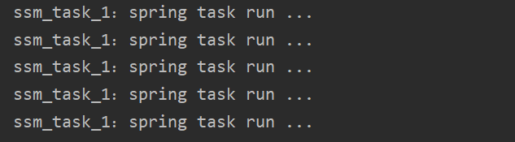

# SpringBoot整合Quartz和spring task定时任务

[TOC]

## SpringBoot整合Quartz

**相关概念**

◆ 工作（Job）：用于定义具体执行的工作

◆ 工作明细（JobDetail）：用于描述定时工作相关的信息（属性）

◆ 触发器（Trigger）：用于描述触发工作的规则，通常使用cron表达式定义调度规则

◆ 调度器（Scheduler）：描述了工作明细与触发器的对应关系

### 一、导包

```xml
<!--quartz依赖-->
<dependency>
  <groupId>org.springframework.boot</groupId>
  <artifactId>spring-boot-starter-quartz</artifactId>
</dependency>
```

### 二、写代码

1、定义具体要执行的任务，继承`QuartzJobBean`

```java
/**
 * 定义具体执行的工作
 */
public class MyQuartz extends QuartzJobBean {
    @Override
    protected void executeInternal(JobExecutionContext context) throws JobExecutionException {
        System.out.println("quartz job run...");
    }
}
```

2、创建一个配置文件`QuartzConfig`,定义工作明细与触发器，并绑定对应关系

```java
/**
 * 2.设定一个配置类
 */
@Configuration
public class QuartzConfig {

    /**
     * 工作明细
     * @return
     */
    @Bean
    public JobDetail printJobDetail() {
        //绑定具体的工作
        return JobBuilder
                .newJob(MyQuartz.class)
                .storeDurably()
                .build();
    }

    /**
     * 触发器
     * @return
     */
    @Bean
    public Trigger printJobTrigger() {
        //绑定对应的工作明细
        ScheduleBuilder<? extends Trigger> schedBuilder = CronScheduleBuilder.cronSchedule("0/5 * * * * ?");
        return TriggerBuilder
                .newTrigger()
                .forJob(printJobDetail())
                .withSchedule(schedBuilder)
                .build();
    }
}
```

3、执行启动类即可执行任务。


## spring task

### 步骤

1、在启动类上添加注解`@EnableScheduling`.

2、定义一个`bean`,包含一个方法（该方法为具体执行的工作）。

3、给该方法添加注解`@Scheduled`，并指定执行的相关配置。

```java

@Component
public class MyBean {
    //表示每隔3s执行一次
    @Scheduled(cron = "0/3 * * * * ?")
    public void run() {
        System.out.println("spring task run ...");
    }
}
```

**扩展：**
也可以进行一些高级的配置。

```yml
spring:
  task:
    scheduling:
      #任务调度线程池大小 默认 1
      pool:
        size: 1
      #调度线程名称前缀
      thread-name-prefix: ssm_task_ #可以调试的时候能够分清是哪个线程，如：ssm_task_1：spring task run ...
      shutdown:
        #线程池关闭时等待所有任务完成（默认false）
        await-termination: false
        # 调度线程关闭前最大等待时间，确保最后一定关闭
        await-termination-period: 10s
```

运行截图：

