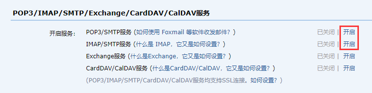

# SpringBoot整合JavaMail

> * SMTP（Simple Mail Transfer Protocol）： 简单邮件传输协议，用于发送电子邮件的传输协议
>* POP3（Post Office Protocol - Version 3）： 用于接收电子邮件的标准协议
>* IMAP（Internet Mail Access Protocol）： 互联网消息协议，是POP3的替代协议

## 一、添加依赖

`pom.xml`

```xml
<!--mail-->
<dependency>
  <groupId>org.springframework.boot</groupId>
  <artifactId>spring-boot-starter-mail</artifactId>
</dependency>
```

## 二、写代码

1、配置文件

```yml
spring:
  mail:
    host: smtp.qq.com
    username: xxxx@qq.com
    password: xxxx
    default-encoding: utf-8
```

**说明：**

1. host为邮件服务器

2. username为邮箱账号

3. password为邮箱授权码（非邮箱密码）

   

2、先整个实体类`Mail.java`

`Mail.java`

```java

@Data
public class Mail {
    private String from;
    private String to;
    private String subject;
    private String text;
    //是否解析文本中的html内容
    private boolean isHtml = false;
    //是否包含附件
    private boolean containsAttachment = false;
    private File attachment;
}
```

2、创建一个`SendMailService.java`和其实现类`SendMailServiceImpl.java`.

`SendMailService.java`

```java
public interface SendMailService {
    void sendSimpleMail(Mail mail);

    void sendMimeMail(Mail mail);
}
```

`SendMailServiceImpl.java`

```java

@Service
public class SendMailServiceImpl implements SendMailService {

    @Autowired
    private JavaMailSender javaMailSender;

    @Override
    public void sendSimpleMail(Mail mail) {
        SimpleMailMessage message = new SimpleMailMessage();
        message.setFrom(mail.getFrom());
        message.setTo(mail.getTo());
        message.setSubject(mail.getSubject());
        message.setText(mail.getText());
        javaMailSender.send(message);
    }

    @Override
    public void sendMimeMail(Mail mail) {
        MimeMessage message = javaMailSender.createMimeMessage();
        try {
            //这个构造方法可以设置是否包含附件
            MimeMessageHelper helper = new MimeMessageHelper(message, mail.isContainsAttachment());
            //发送人
            helper.setFrom(mail.getFrom());
            //接收人
            helper.setTo(mail.getTo());
            //邮件主题
            helper.setSubject(mail.getSubject());
            //邮件内容-是否解析HTML文本（默认false）
            helper.setText(mail.getText(), mail.isHtml());
            if (mail.isContainsAttachment()) {
                //添加附件
                helper.addAttachment(mail.getAttachment().getName(), mail.getAttachment());
            }
        } catch (MessagingException e) {
            e.printStackTrace();
        }
        javaMailSender.send(message);
    }
}
```

3、创建测试类

`Springboot23MailApplicationTests.java`

```java

@SpringBootTest
class Springboot23MailApplicationTests {

    @Autowired
    private SendMailService sendMailService;

    @Test
    void testSendSimpleMail() {
        Mail mail = new Mail();
        //mail.setFrom("xxxx");
        //会替换这个邮箱名称，改用括号里面的名称。
        mail.setFrom("xxxx" + "(小甜甜)");
        mail.setTo("xxxx@163.com");
        mail.setSubject("测试邮件发送");
        mail.setText("这是正文内容...");
        sendMailService.sendSimpleMail(mail);
    }

    @Test
    void testSendMimeMail() {
        Mail mail = new Mail();
        mail.setFrom("xxxx" + "(小甜甜)");
        mail.setTo("xxxx@163.com");
        mail.setSubject("测试邮件发送");
        mail.setText(
                ""
                + "<a href='https://www.baidu.com/'>百度一下</a>");
        mail.setHtml(true);
        sendMailService.sendMimeMail(mail);
    }

    /**
     * 添加附件
     */
    @Test
    void testSendMimeMailContainsFile() {
        Mail mail = new Mail();
        mail.setFrom("xxxxxx" + "(小甜甜)");
        mail.setTo("xxxxxx@163.com");
        mail.setSubject("测试邮件发送");
        mail.setText(
                ""
                + "<a href='https://www.baidu.com/'>百度一下</a>");
        mail.setHtml(true);
        mail.setContainsAttachment(true);
        mail.setAttachment(new File(
                "F:\\Study\\IdeaProjects\\springboot_study_20220225\\springboot_23_mail\\src\\main\\java\\com\\example\\service\\impl\\SendMailServiceImpl.java"));
        sendMailService.sendMimeMail(mail);
    }
}
```