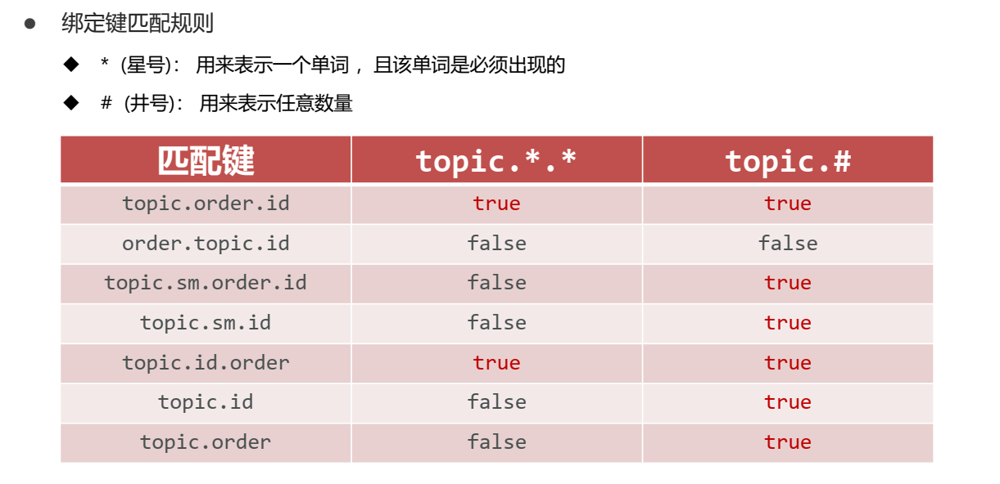

# SpringBoot整合消息队列

## 一、手动模拟消息

> 案例介绍:
> 模拟创建一个订单之后经过服务调用或处理各种业务之后发送短信。

1、写一个订单接口和短信接口。

`OrderService.java`

```java
public interface OrderService {
    public void order(String id);
}
```

`MessageService.java`

```java
public interface MessageService {

    public void sendMessage(String id);

    public String doMessage();
}
```

2、简单实现这两个接口。

`OrderServiceImpl.java`

```java

@Service
public class OrderServiceImpl implements OrderService {

    @Autowired
    private MessageService messageService;

    @Override
    public void order(String id) {
        //一系列操作，包含各种服务调用，处理各种业务
        System.out.println("业务订单开始处理");
        //短信消息处理
        messageService.sendMessage(id);
        System.out.println("业务订单处理结束");
        System.out.println("================================");
    }
}
```

`MessageServiceImpl.java`

```java

@Service
public class MessageServiceImpl implements MessageService {

    private ArrayList<String> list = new ArrayList<String>();

    @Override
    public void sendMessage(String id) {
        System.out.println("待发送短信的订单已纳入消息队列，id:" + id);
        list.add(id);
    }

    @Override
    public String doMessage() {
        if (list.size() <= 0) {
            return "无消息可处理";
        }
        String remove = list.remove(0);
        System.out.println("已完成短信发送业务，id:" + remove);
        return remove;
    }
}
```

3、创建两个controller测试即可。

`OrderController.java`

```java

@RestController
@RequestMapping("/order")
public class OrderController {

    @Autowired
    private OrderService orderService;

    @PostMapping("/{id}")
    public void order(@PathVariable(value = "id") String id) {
        orderService.order(id);
    }
}
```

`MessageController.java`

```java

@RestController
@RequestMapping(value = "/msg")
public class MessageController {

    @Autowired
    private MessageService messageService;

    @GetMapping
    public String doMessage() {
        return messageService.doMessage();
    }
}
```

4、测试结果


## 二、springboot整合ActiveMQ

### 1、下载安装ActiveMQ

> 下载地址： https://activemq.apache.org/components/classic/download/

* 启动服务
    ```shell
    activemq.bat
    ```

* 访问ActiveMQ服务器
    ```http request
    http://127.0.0.1:8161/
    ```
  服务端口(编程)： 61616， 管理后台端口： 8161

  用户名&密码： admin
  

### 2、整合ActiveMQ

1）导依赖

```xml
<!--activemq-->
<dependency>
  <groupId>org.springframework.boot</groupId>
  <artifactId>spring-boot-starter-activemq</artifactId>
</dependency>
```

2）做配置

```yml
server:
  port: 80

spring:
  activemq:
    broker-url: tcp://localhost:61616
```

3）写代码

需要在`OrderServiceImpl.java`中替换一下实现。

```java
@Autowired
//private MessageService messageService;
private MessageActiveMQService messageService;
```

`MessageActiveMQService.java`

```java
public interface MessageActiveMQService {
    public void sendMessage(String id);

    public String doMessage();
}
```

`MessageActiveMQServiceImpl.java`

```java

@Service
public class MessageActiveMQServiceImpl implements MessageActiveMQService {

    @Autowired
    private JmsMessagingTemplate jmsMessagingTemplate;

    @Override
    public void sendMessage(String id) {
        jmsMessagingTemplate.convertAndSend(id);
        System.out.println("待发送短信的订单已纳入消息队列，id:" + id);
    }

    @Override
    public String doMessage() {
        String id = jmsMessagingTemplate.receiveAndConvert(String.class);
        System.out.println("已完成短信发送业务，id:" + id);
        return id;
    }
}
```

`MessageActiveMQController.java`

```java

@RestController
@RequestMapping(value = "/msgMQ")
public class MessageActiveMQController {

    @Autowired
    private MessageActiveMQService messageActiveMQService;

    @GetMapping
    public String doMessage() {
        return messageActiveMQService.doMessage();
    }
}
```

4）运行测试 会报个异常：

```shell
java.lang.IllegalStateException: No 'defaultDestination' or 'defaultDestinationName' specified. Check configuration of JmsMessagingTemplate.
```

需要在配置文件中加个默认的配置：

```yml
server:
  port: 80

spring:
  activemq:
    broker-url: tcp://localhost:61616
  jms:
    template:
      # 配置一个默认的保存位置
      default-destination: test
```

然后重启运行就可以了。

**注意：** 一般在代码中进行配置（但也需要有一个默认的配置），在代码中配置如下：

```java
jmsMessagingTemplate.convertAndSend("order.queue.id",id);
```

在使用的时候也需要指定`destinationName`：

```java
String id=jmsMessagingTemplate.receiveAndConvert("order.queue.id",String.class);
```

5）改进

加一个监听器，自动接收消息并处理。

`MessageListener.java`

```java
/**
 * 消息队列的监听器
 */
@Component
public class MessageListener {

    //添加一个队列的监听器，只要一有消息就会被该方法接收并处理
    @JmsListener(destination = "order.queue.id")
    //该方法处理完之后，将返回值又发送到另一个消息队列处理
    @SendTo(value = "order.other.queue.id")
    public String sendMsg(String id) {
        System.out.println("已完成短信发送操作,id:" + id);
        return id;
    }

    //可以处理上一个消息队列处理之后加入新队列的消息
    @JmsListener(destination = "order.other.queue.id")
    public void processOtherMessage(String id) {
        System.out.println("完成处理订单的操作，id:" + id);
    }
}

```

6）默认的是点对点的配置，可以在配置中设置发布订阅的形式。

```yml
server:
  port: 80

spring:
  activemq:
    broker-url: tcp://localhost:61616
  jms:
    template:
      # 配置一个默认的保存位置
      default-destination: test
    # 发布订阅的形式，默认是点对点
    pub-sub-domain: true
```


## 三、springboot整合RabbitMQ

相关知识：


导入SpringBoot整合RabbitMQ坐标

```xml
 <!--amqp-->
<dependency>
  <groupId>org.springframework.boot</groupId>
  <artifactId>spring-boot-starter-amqp</artifactId>
</dependency>
```

**说明：** `RabbitMQ`是一种协议，在`amqp`的依赖中包含rabbitmq的实现。

### 1、direct模式

1）配置RabbitMQ （采用默认配置）

```yml
server:
  port: 80

spring:
  rabbitmq:
    host: localhost
    port: 5672
```

2）写两个接口

`MessageDirectService.java`

```java
public interface MessageDirectService {
    public void sendMessage(String id);
}
```

`OrderDirectService.java`

```java
public interface OrderDirectService {
    public void order(String id);
}
```

3）实现这两个接口

`MessageDirectServiceImpl.java`

```java

@Service
public class MessageDirectServiceImpl implements MessageDirectService {

    @Autowired
    private AmqpTemplate amqpTemplate;

    @Override
    public void sendMessage(String id) {
        amqpTemplate.convertAndSend("directExchange", "direct", id);
        System.out.println("待发送短信的订单已纳入消息队列(rabbitmq direct impl)，id:" + id);
    }
}
```

`OrderDirectServiceImpl.java`

```java

@Service
public class OrderDirectServiceImpl implements OrderDirectService {

    @Autowired
    private MessageDirectService messageDirectService;

    @Override
    public void order(String id) {
        //一系列操作，包含各种服务调用，处理各种业务
        System.out.println("业务订单开始处理");
        //短信消息处理
        messageDirectService.sendMessage(id);
        System.out.println("业务订单处理结束");
        System.out.println("================================");
    }
}
```

4）写一个controller用来测试。

`OrderDirectController.java`

```java

@RestController
@RequestMapping(value = "/orderDirect")
public class OrderDirectController {
    @Autowired
    private OrderDirectService orderDirectService;

    @PostMapping("/{id}")
    public void order(@PathVariable(value = "id") String id) {
        orderDirectService.order(id);
    }
}
```

5）定义一个RabbitMQ配置类。

`RabbitDirectConfig.java`

```java

@Configuration
public class RabbitDirectConfig {
    @Bean
    public Queue directQueue() {
        // durable:是否持久化,默认true
        // exclusive:是否当前连接专用， 默认false，连接关闭后队列即被删除
        // autoDelete:是否自动删除，默认false， 当生产者或消费者不再使用此队列，自动删除
        return new Queue("direct_queue", true, false, false);
    }

    @Bean
    public DirectExchange directExchange() {
        return new DirectExchange("directExchange");
    }

    @Bean
    public Binding bindingDirect() {
        //直连模式没有匹配规则*或#
        return BindingBuilder.bind(directQueue()).to(directExchange()).with("direct");
    }

    /**
     * 相当于把direct_queue和direct_queue2绑定到同一个directExchange
     * @return
     */
    @Bean
    public Queue directQueue2() {
        return new Queue("direct_queue2");
    }

    @Bean
    public Binding bindingDirect2() {
        return BindingBuilder.bind(directQueue2()).to(directExchange()).with("direct2");
    }
}
```

6）配置消息队列的监听器。

`RabbitDirectMessageListener.java`

```java
//rabbitmq消息队列监听器
@Component
public class RabbitDirectMessageListener {

    @RabbitListener(queues = "direct_queue")
    public void receive(String id) {
        System.out.println("已完成短信发送业务（rabbitmq direct listener1）:id" + id);
    }
}
```

如果再定义一个该队列的监听器，将会以轮询的方式执行。

`RabbitDirectMessageListener2.java`

```java
//rabbitmq消息队列监听器
@Component
public class RabbitDirectMessageListener2 {

    @RabbitListener(queues = "direct_queue")
    public void receive(String id) {
        System.out.println("已完成短信发送业务（rabbitmq direct listener2）:id" + id);
    }
}
```

7）测试。

```text
================================
业务订单开始处理
待发送短信的订单已纳入消息队列(rabbitmq direct impl)，id:11523423242
业务订单处理结束
================================
已完成短信发送业务（rabbitmq direct listener1）:id11523423242
================================
业务订单开始处理
待发送短信的订单已纳入消息队列(rabbitmq direct impl)，id:11523423242
业务订单处理结束
================================
已完成短信发送业务（rabbitmq direct listener2）:id11523423242
================================
业务订单开始处理
待发送短信的订单已纳入消息队列(rabbitmq direct impl)，id:11523423242
业务订单处理结束
================================
已完成短信发送业务（rabbitmq direct listener1）:id11523423242
```

说明：配置同一个消息队列的两个监听器是采用轮询的方式处理消息的。

### 2、topic模式

1）写两个接口。

`MessageTopicService.java`

```java
public interface MessageTopicService {
    public void sendMessage(String id);
}
```

`OrderTopicService.java`

```java
public interface OrderTopicService {
    public void order(String id);
}
```

2）实现这两个接口。

`MessageTopicServiceImpl.java`

```java

@Service
public class MessageTopicServiceImpl implements MessageTopicService {

    @Autowired
    private AmqpTemplate amqpTemplate;

    @Override
    public void sendMessage(String id) {
        //topic.order.id如果符合多个bindingTopic绑定规则的队列，那么就会进入多个队列。
        amqpTemplate.convertAndSend("topicExchange", "topic.order.id", id);
        System.out.println("待发送短信的订单已纳入消息队列(rabbitmq topic impl)，id:" + id);
    }
}
```

`OrderTopicServiceImpl.java`

```java

@Service
public class OrderTopicServiceImpl implements OrderTopicService {

    @Autowired
    private MessageTopicService messageTopicService;

    @Override
    public void order(String id) {
        //一系列操作，包含各种服务调用，处理各种业务
        System.out.println("业务订单开始处理");
        //短信消息处理
        messageTopicService.sendMessage(id);
        System.out.println("业务订单处理结束");
        System.out.println("================================");
    }
}
```

3）写一个controller用来测试。

`OrderTopicController.java`

```java

@RestController
@RequestMapping(value = "/orderTopic")
public class OrderTopicController {
    @Autowired
    private OrderTopicService orderTopicService;

    @PostMapping("/{id}")
    public void order(@PathVariable(value = "id") String id) {
        orderTopicService.order(id);
    }
}
```

4）定义一个RabbitMQ配置类。

`RabbitTopicConfig.java`

```java

@Configuration
public class RabbitTopicConfig {
    @Bean
    public Queue topicQueue() {
        return new Queue("topic_queue", true, false, false);
    }

    @Bean
    public TopicExchange topicExchange() {
        return new TopicExchange("topicExchange");
    }

    @Bean
    public Binding bindingTopic() {
        //与直连模式不同的地方，可以自定义规则。
        //符合topic.*.id这个规则而发送的消息，会进入到该规则绑定的topic_queue这个队列中
        return BindingBuilder.bind(topicQueue()).to(topicExchange()).with("topic.*.id");
    }

    @Bean
    public Queue topicQueue2() {
        return new Queue("topic_queue2");
    }

    @Bean
    public Binding bindingTopic2() {
        return BindingBuilder.bind(topicQueue2()).to(topicExchange()).with("topic.order.*");
    }
}
```

5）定义一个监听器。

`MessageTopicListener.java`

```java
//rabbitmq消息队列监听器
@Component
public class MessageTopicListener {

    @RabbitListener(queues = "topic_queue")
    public void receive(String id) {
        System.out.println("已完成短信发送业务（rabbitmq topic listener 1）:id" + id);
    }

    @RabbitListener(queues = "topic_queue2")
    public void receive2(String id) {
        System.out.println("已完成短信发送业务（rabbitmq topic listener 2）:id" + id);
    }
}
```

6）测试。

```text
================================
业务订单开始处理
待发送短信的订单已纳入消息队列(rabbitmq topic impl)，id:11523423242
业务订单处理结束
================================
已完成短信发送业务（rabbitmq topic listener 2）:id11523423242
已完成短信发送业务（rabbitmq topic listener 1）:id11523423242
================================
业务订单开始处理
待发送短信的订单已纳入消息队列(rabbitmq topic impl)，id:11523423242
业务订单处理结束
================================
已完成短信发送业务（rabbitmq topic listener 2）:id11523423242
已完成短信发送业务（rabbitmq topic listener 1）:id11523423242
================================
业务订单开始处理
待发送短信的订单已纳入消息队列(rabbitmq topic impl)，id:11523423242
业务订单处理结束
================================
已完成短信发送业务（rabbitmq topic listener 2）:id11523423242
已完成短信发送业务（rabbitmq topic listener 1）:id11523423242
```

**说明：** 由于发送的消息符合多个绑定规则，所以会进入多个规则所绑定的消息队列中。

**Topic模式绑定规则：**



