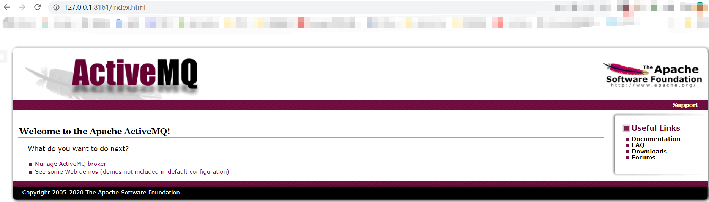
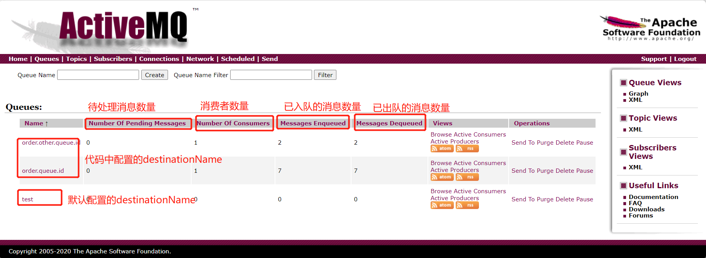

# 二、springboot整合ActiveMQ

## 一、下载安装ActiveMQ

> 下载地址： https://activemq.apache.org/components/classic/download/

* 启动服务
    ```shell
    activemq.bat
    ```

* 访问ActiveMQ服务器
    ```http request
    http://127.0.0.1:8161/
    ```
  服务端口(编程)： 61616， 管理后台端口： 8161

  用户名&密码： admin
  

## 二、整合ActiveMQ

1、导依赖

```xml
<!--activemq-->
<dependency>
  <groupId>org.springframework.boot</groupId>
  <artifactId>spring-boot-starter-activemq</artifactId>
</dependency>
```

2、做配置

```yml
server:
  port: 80

spring:
  activemq:
    broker-url: tcp://localhost:61616
```

3、写代码

需要在`OrderServiceImpl.java`中替换一下实现。

```java
@Autowired
//private MessageService messageService;
private MessageActiveMQService messageService;
```

`MessageActiveMQService.java`

```java
public interface MessageActiveMQService {
    public void sendMessage(String id);

    public String doMessage();
}
```

`MessageActiveMQServiceImpl.java`

```java

@Service
public class MessageActiveMQServiceImpl implements MessageActiveMQService {

    @Autowired
    private JmsMessagingTemplate jmsMessagingTemplate;

    @Override
    public void sendMessage(String id) {
        jmsMessagingTemplate.convertAndSend(id);
        System.out.println("待发送短信的订单已纳入消息队列，id:" + id);
    }

    @Override
    public String doMessage() {
        String id = jmsMessagingTemplate.receiveAndConvert(String.class);
        System.out.println("已完成短信发送业务，id:" + id);
        return id;
    }
}
```

`MessageActiveMQController.java`

```java

@RestController
@RequestMapping(value = "/msgMQ")
public class MessageActiveMQController {

    @Autowired
    private MessageActiveMQService messageActiveMQService;

    @GetMapping
    public String doMessage() {
        return messageActiveMQService.doMessage();
    }
}
```

4、运行测试 会报个异常：

```shell
java.lang.IllegalStateException: No 'defaultDestination' or 'defaultDestinationName' specified. Check configuration of JmsMessagingTemplate.
```

需要在配置文件中加个默认的配置：

```yml
server:
  port: 80

spring:
  activemq:
    broker-url: tcp://localhost:61616
  jms:
    template:
      # 配置一个默认的保存位置
      default-destination: test
```

然后重启运行就可以了。

**注意：** 一般在代码中进行配置（但也需要有一个默认的配置），在代码中配置如下：

```java
jmsMessagingTemplate.convertAndSend("order.queue.id",id);
```

在使用的时候也需要指定`destinationName`：

```java
String id=jmsMessagingTemplate.receiveAndConvert("order.queue.id",String.class);
```

5、改进

加一个监听器，自动接收消息并处理。

`MessageListener.java`

```java
/**
 * 消息队列的监听器
 */
@Component
public class MessageListener {

    //添加一个队列的监听器，只要一有消息就会被该方法接收并处理
    @JmsListener(destination = "order.queue.id")
    //该方法处理完之后，将返回值又发送到另一个消息队列处理
    @SendTo(value = "order.other.queue.id")
    public String sendMsg(String id) {
        System.out.println("已完成短信发送操作,id:" + id);
        return id;
    }

    //可以处理上一个消息队列处理之后加入新队列的消息
    @JmsListener(destination = "order.other.queue.id")
    public void processOtherMessage(String id) {
        System.out.println("完成处理订单的操作，id:" + id);
    }
}

```

6、默认的是点对点的配置，可以在配置中设置发布订阅的形式。

```yml
server:
  port: 80

spring:
  activemq:
    broker-url: tcp://localhost:61616
  jms:
    template:
      # 配置一个默认的保存位置
      default-destination: test
    # 发布订阅的形式，默认是点对点
    pub-sub-domain: true
```



