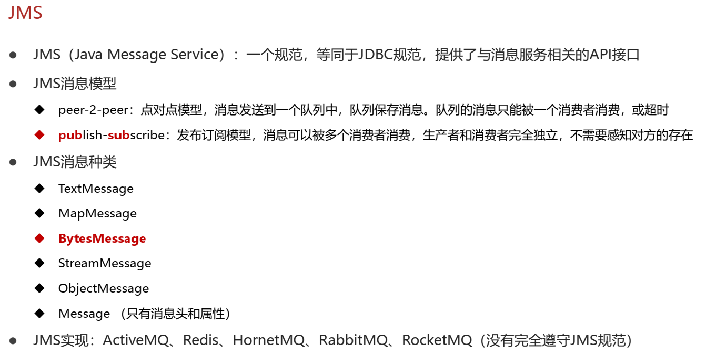
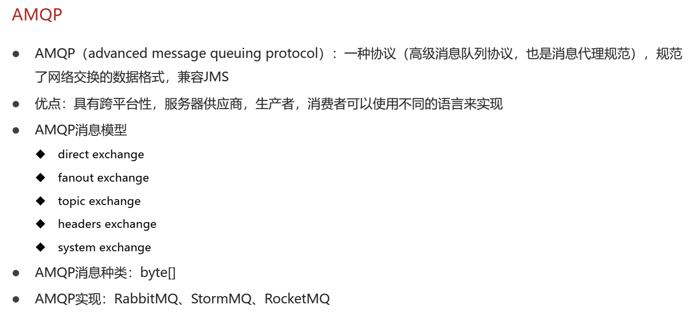

# springboot整合RabbitMQ

> [windows下安装RabbitMQ](./Windows安装RabbitMQ.md)

相关知识：





导入SpringBoot整合RabbitMQ坐标

```xml
 <!--amqp-->
<dependency>
  <groupId>org.springframework.boot</groupId>
  <artifactId>spring-boot-starter-amqp</artifactId>
</dependency>
```

**说明：** `RabbitMQ`是一种协议，在`amqp`的依赖中包含rabbitmq的实现。

## 一、direct模式

1、配置RabbitMQ （采用默认配置）

```yml
server:
  port: 80

spring:
  rabbitmq:
    host: localhost
    port: 5672
```

2、写两个接口

`MessageDirectService.java`

```java
public interface MessageDirectService {
    public void sendMessage(String id);
}
```

`OrderDirectService.java`

```java
public interface OrderDirectService {
    public void order(String id);
}
```

3、实现这两个接口

`MessageDirectServiceImpl.java`

```java

@Service
public class MessageDirectServiceImpl implements MessageDirectService {

    @Autowired
    private AmqpTemplate amqpTemplate;

    @Override
    public void sendMessage(String id) {
        amqpTemplate.convertAndSend("directExchange", "direct", id);
        System.out.println("待发送短信的订单已纳入消息队列(rabbitmq direct impl)，id:" + id);
    }
}
```

`OrderDirectServiceImpl.java`

```java

@Service
public class OrderDirectServiceImpl implements OrderDirectService {

    @Autowired
    private MessageDirectService messageDirectService;

    @Override
    public void order(String id) {
        //一系列操作，包含各种服务调用，处理各种业务
        System.out.println("业务订单开始处理");
        //短信消息处理
        messageDirectService.sendMessage(id);
        System.out.println("业务订单处理结束");
        System.out.println("================================");
    }
}
```

4、写一个controller用来测试。

`OrderDirectController.java`

```java

@RestController
@RequestMapping(value = "/orderDirect")
public class OrderDirectController {
    @Autowired
    private OrderDirectService orderDirectService;

    @PostMapping("/{id}")
    public void order(@PathVariable(value = "id") String id) {
        orderDirectService.order(id);
    }
}
```

5、定义一个RabbitMQ配置类。

`RabbitDirectConfig.java`

```java

@Configuration
public class RabbitDirectConfig {
    @Bean
    public Queue directQueue() {
        // durable:是否持久化,默认true
        // exclusive:是否当前连接专用， 默认false，连接关闭后队列即被删除
        // autoDelete:是否自动删除，默认false， 当生产者或消费者不再使用此队列，自动删除
        return new Queue("direct_queue", true, false, false);
    }

    @Bean
    public DirectExchange directExchange() {
        return new DirectExchange("directExchange");
    }

    @Bean
    public Binding bindingDirect() {
        //直连模式没有匹配规则*或#
        return BindingBuilder.bind(directQueue()).to(directExchange()).with("direct");
    }

    /**
     * 相当于把direct_queue和direct_queue2绑定到同一个directExchange
     * @return
     */
    @Bean
    public Queue directQueue2() {
        return new Queue("direct_queue2");
    }

    @Bean
    public Binding bindingDirect2() {
        return BindingBuilder.bind(directQueue2()).to(directExchange()).with("direct2");
    }
}
```

6、配置消息队列的监听器。

`RabbitDirectMessageListener.java`

```java
//rabbitmq消息队列监听器
@Component
public class RabbitDirectMessageListener {

    @RabbitListener(queues = "direct_queue")
    public void receive(String id) {
        System.out.println("已完成短信发送业务（rabbitmq direct listener1）:id" + id);
    }
}
```

如果再定义一个该队列的监听器，将会以轮询的方式执行。

`RabbitDirectMessageListener2.java`

```java
//rabbitmq消息队列监听器
@Component
public class RabbitDirectMessageListener2 {

    @RabbitListener(queues = "direct_queue")
    public void receive(String id) {
        System.out.println("已完成短信发送业务（rabbitmq direct listener2）:id" + id);
    }
}
```

7、测试。

```text
================================
业务订单开始处理
待发送短信的订单已纳入消息队列(rabbitmq direct impl)，id:11523423242
业务订单处理结束
================================
已完成短信发送业务（rabbitmq direct listener1）:id11523423242
================================
业务订单开始处理
待发送短信的订单已纳入消息队列(rabbitmq direct impl)，id:11523423242
业务订单处理结束
================================
已完成短信发送业务（rabbitmq direct listener2）:id11523423242
================================
业务订单开始处理
待发送短信的订单已纳入消息队列(rabbitmq direct impl)，id:11523423242
业务订单处理结束
================================
已完成短信发送业务（rabbitmq direct listener1）:id11523423242
```

说明：配置同一个消息队列的两个监听器是采用轮询的方式处理消息的。

## 2、topic模式

1、写两个接口。

`MessageTopicService.java`

```java
public interface MessageTopicService {
    public void sendMessage(String id);
}
```

`OrderTopicService.java`

```java
public interface OrderTopicService {
    public void order(String id);
}
```

2、实现这两个接口。

`MessageTopicServiceImpl.java`

```java

@Service
public class MessageTopicServiceImpl implements MessageTopicService {

    @Autowired
    private AmqpTemplate amqpTemplate;

    @Override
    public void sendMessage(String id) {
        //topic.order.id如果符合多个bindingTopic绑定规则的队列，那么就会进入多个队列。
        amqpTemplate.convertAndSend("topicExchange", "topic.order.id", id);
        System.out.println("待发送短信的订单已纳入消息队列(rabbitmq topic impl)，id:" + id);
    }
}
```

`OrderTopicServiceImpl.java`

```java

@Service
public class OrderTopicServiceImpl implements OrderTopicService {

    @Autowired
    private MessageTopicService messageTopicService;

    @Override
    public void order(String id) {
        //一系列操作，包含各种服务调用，处理各种业务
        System.out.println("业务订单开始处理");
        //短信消息处理
        messageTopicService.sendMessage(id);
        System.out.println("业务订单处理结束");
        System.out.println("================================");
    }
}
```

3、写一个controller用来测试。

`OrderTopicController.java`

```java

@RestController
@RequestMapping(value = "/orderTopic")
public class OrderTopicController {
    @Autowired
    private OrderTopicService orderTopicService;

    @PostMapping("/{id}")
    public void order(@PathVariable(value = "id") String id) {
        orderTopicService.order(id);
    }
}
```

4、定义一个RabbitMQ配置类。

`RabbitTopicConfig.java`

```java

@Configuration
public class RabbitTopicConfig {
    @Bean
    public Queue topicQueue() {
        return new Queue("topic_queue", true, false, false);
    }

    @Bean
    public TopicExchange topicExchange() {
        return new TopicExchange("topicExchange");
    }

    @Bean
    public Binding bindingTopic() {
        //与直连模式不同的地方，可以自定义规则。
        //符合topic.*.id这个规则而发送的消息，会进入到该规则绑定的topic_queue这个队列中
        return BindingBuilder.bind(topicQueue()).to(topicExchange()).with("topic.*.id");
    }

    @Bean
    public Queue topicQueue2() {
        return new Queue("topic_queue2");
    }

    @Bean
    public Binding bindingTopic2() {
        return BindingBuilder.bind(topicQueue2()).to(topicExchange()).with("topic.order.*");
    }
}
```

5、定义一个监听器。

`MessageTopicListener.java`

```java
//rabbitmq消息队列监听器
@Component
public class MessageTopicListener {

    @RabbitListener(queues = "topic_queue")
    public void receive(String id) {
        System.out.println("已完成短信发送业务（rabbitmq topic listener 1）:id" + id);
    }

    @RabbitListener(queues = "topic_queue2")
    public void receive2(String id) {
        System.out.println("已完成短信发送业务（rabbitmq topic listener 2）:id" + id);
    }
}
```

6、测试。

```text
================================
业务订单开始处理
待发送短信的订单已纳入消息队列(rabbitmq topic impl)，id:11523423242
业务订单处理结束
================================
已完成短信发送业务（rabbitmq topic listener 2）:id11523423242
已完成短信发送业务（rabbitmq topic listener 1）:id11523423242
================================
业务订单开始处理
待发送短信的订单已纳入消息队列(rabbitmq topic impl)，id:11523423242
业务订单处理结束
================================
已完成短信发送业务（rabbitmq topic listener 2）:id11523423242
已完成短信发送业务（rabbitmq topic listener 1）:id11523423242
================================
业务订单开始处理
待发送短信的订单已纳入消息队列(rabbitmq topic impl)，id:11523423242
业务订单处理结束
================================
已完成短信发送业务（rabbitmq topic listener 2）:id11523423242
已完成短信发送业务（rabbitmq topic listener 1）:id11523423242
```

**说明：** 由于发送的消息符合多个绑定规则，所以会进入多个规则所绑定的消息队列中。

**Topic模式绑定规则：**


